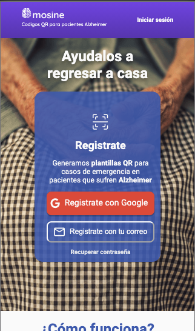

# 💻 Mosine

Mosine nace para solventar las constantes desapariciones de pacientes de Alzheimer por medio de codigos QR.

En Mosine existen tres conceptos importantes que conocer: guardianes, angeles y heroes. Los guardianes son aquellos a cargo de los angeles quienes son los pacientes de Alzheimer. Los heroes pueden ser cualquier persona que encuentre a un angel y se ponga en contacto con su respectivo guardian para que regrese sano y salvo.



## 🛠 Scripts

```bash
# Instalar dependencias
$ npm install

# Encender servidor de desarrollo en localhost:3000
$ npm run dev

# Crear version de producción
$ npm run build

```

## 💎 Tecnologías

- NextJS
- React Hooks
- Styled components
- Axios

## 💣 Despliegue

https://mosine.vercel.app/
